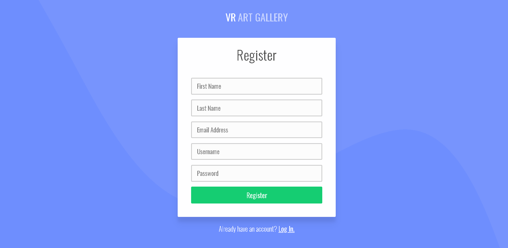
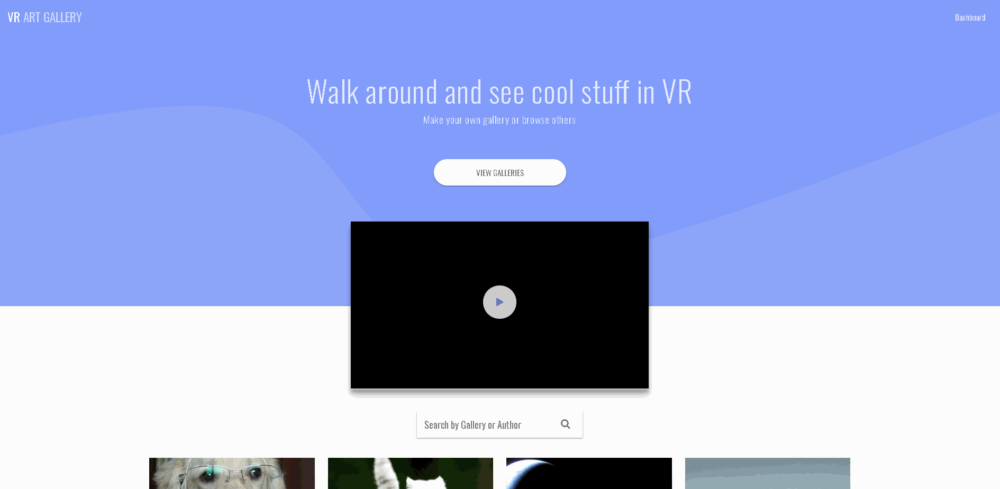
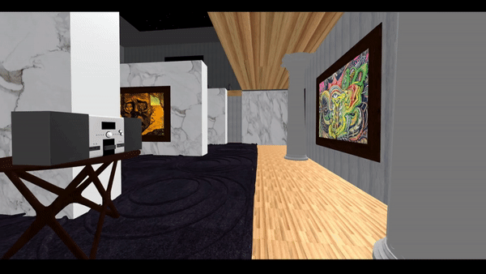

<section>
<h1>What is VR-Art-Gallery?</h1>

VR-Art-Gallery is a full stack, mobile-responsive, virtual reality application built in React and deployed in Preact where users can upload images into their own custom art galleries to display to the world. As a user, you customize your art 2-floor gallery with texture presets for the floors and walls, and choose your own gallery music (all songs were performed by <a href="http://freemusicarchive.org/music/Kevin_MacLeod/">Kevin Macleod</a>).  Additionally, you can favorite other galleries, share their links, or create private galleries that are only accessible by the link you provide.

<h1>Technologies</h1>
  <h2> Virtual Reality Techs:</h2>
  <ul>
    <li>A-Frame</li>
    <li>aframe-extras</li>
    <li>aframe-physics-system</li>
    <li>aframe-react</li>
    <li>aframe-room-component</li>
    <li>aframe-star-system-component</li>
  </ul>
  
  

  The foundation for the 3D environment was built in A-frame with aframe-react serving as a proxy between the aframe framework and react library.  The aframe-physics-system, as well as aframe-etras, were implemented for collision detection between the user and entities in addition to providing a gravitational force for when the user drops down from the 2nd floor to the first.  The aframe-room-component was used to build the 2D dimensional planes for the first-floor and walls of the gallery, which also allowed for the repetition of repeating textures for a more realistic, and less stretched, appearance of the user-selected presets.  The aframe-star-system-component provides the spherical backdrop and populates it with star-like particles. All entities within this application were either imported 3D models, entirely free and under the royalty free license from turboSquid, imported repeating-texture files, or built with aframe.registerComponent (Clock).
  

  
  <h2>Amazon S3 Relevant Techs:</h2>
  <ul>
    <li>attr-accept</li>
    <li>aws-sdk</li>
    <li>uuid</li>
    <li>react-dropzone</li>
  </ul>
  
  
  
  

    Users are able to add images to their gallery thumbnails, as well as populate their gallery, using the react-dropzone on the client-side in combination with aws-sdk in the server - setting up a connection between the client and amazon S3 bucket.  Those images, presets, and captions are then retrieved using the techs listed below.
  

  
  <h2>Client to Backend Techs:</h2>
    <ul>
    <li>bcryptjs</li>
    <li>axios</li>
    <li>dotenv</li>
    <li>massive</li>
    </ul>

  

  
  
Bcryptjs was used for salting and hashing user-created passwords for securely registered accounts, and all sensitive keys, passwords, and related information is stored in dotenv.

  

  
Axios was used for making client to server-side calls, and massive was used for connecting my server-side to the database.

  <h2>Core Application Techs:</h2>
  <ul>
    <li>preact</li>
    <li>preact-compat</li>
    <li>prop-types</li>
    <li>react</li>
    <li>react-dom</li>
    <li>react-redux</li>
    <li>react-router-dom</li>
    <li>react-scripts</li>
    <li>redux</li>
  </ul>

  

  As mentioned in the opening description, this application was built in react and therefore contains all of the same scripts as a react app; however, the deployed application is in preact using preact-compat alias in the package-json.  React-router-dom is used for redirected users from landing-page to lobby as well as anyone's gallery by taking in the author and gallery name as params.  Redux was implemented as a solution to a run-time error in passing image URLs in the mounting of the ArtGallery component to the assets file which contains the portrait entities populating the gallery.  Passing urls directly via props resulted in 
  

<h1>Stylistic Features</h1>
  <ul>
    <li>Pagination</li>
    <li>Notifications (Favorites❤️, Sharing🤝)</li>
  </ul>

  

<h1>Functional Features</h1>
  <ul>
    <li>Search Filters</li>
    <li>Portal Hopping</li>
    <li>Gallery Jams🎵</li>
  </ul>

  
  
  

  

  A-Frame has a built in link entity that functions identically to an anchor tag and allows users to traverse from a-scene (3D environment) to a-scene; however, we found this incompatible within the react library, specifically with react-router-dom, and re-created the shader and portal entity without the link functionality; We simply created 
  

<h1>Creators</h1>
  

    <a href="https://www.bradysnuggs.net/">Brady Snuggs</a>
    &
    <a href="https://jakerow.land/">Jake Rowland</a>
  

<h1>Stretch Goals</h1>
  <ul>
    <li>Make Gallery multi-network and supports audio chat.</li>
    <li>Notifications tab so users can get statistics on views, favorites, shares, and who is looking at their galleries specifically</li>
    <li>Built in Messages tab so users can message one another within Lobby/Landing Page - ostensibly in 3D Gallery as well.</li>
    <li>Expand presets so that users are not limited to built-in application presets</li>
  </ul>
</section>

